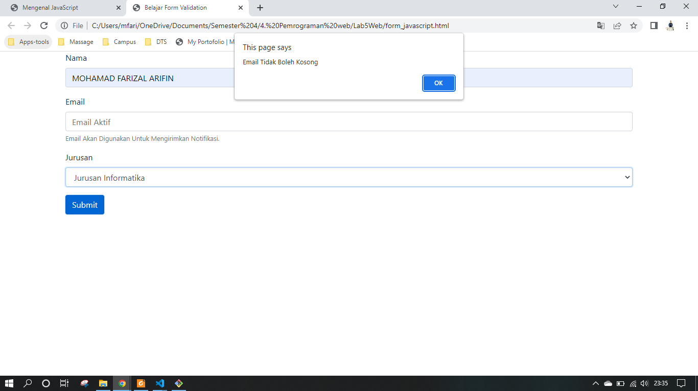

# Lab5Web

**Nama  : Mohamad Farizal Arifin**

**Nim   : 312010231**

**Kelas : TI.20.B.1**

<br>

**Langkah - langkah praktikum**<br>
Persiapan membuat dokumen HTML dengan nama file **lab5_javascript.html** seperti berikut.<br>

```
<!DOCTYPE html>
<html lang="en">
<head>
    <title>Mengenal JavaScript</title>
</head>
<body>
    <h1>Pengenalan JavaScript</h1>
    <h3>Contoh document.write dan console.log</h3>
    <script>
        document.write("Hello World");
        console.log("Hello World");
    </script>
</body>
</html>
```
<br>
Kemudian buka browser untuk melihat hasilnya. <br>
Berikut hasilnya :<br>
<br>

 <br>
<br>

**Javascrip Dasar**<br>

Pemakaian Alert sebagai property window.<br>
 <br>
<br>

Pemakaian method dalam objek<br>
 <br>
<br>

Pemakaian Prompt<br>
 <br>
<br>

Pembuatan fungsi dan cara pemanggilannya<br>
 <br>
<br>

**Dasar Pemrograman Di Javascript**<br>

Operasi dasar aritmatika<br>
 <br>
<br>

Seleksi kondisi (if..else)<br>
 <br>
<br>

Penggunaan operator switch untuk seleksi kondisi<br>
 <br>
<br>

**Pembuatan Form**

Form Input<br>
 <br>
<br>

Form Button.<br>
 <br>
<br>

HTML DOM<br>
Pilihan menggunakan checkBox dengan perhitungan otomatis<br>
 <br>
<br>
<br>

**Pertanyaan dan Tugas**<br>
1. Buat script untuk melakukan validasi pada isian form.<br>

**Jawab :**<br>
Berikut script<br>

```
<!DOCTYPE html>
<html lang="en">
<head>
    <title>Form Validation</title>
    <link rel="stylesheet" href="https://stackpath.bootstrapcdn.com/bootstrap/4.4.1/css/bootstrap.min.css">
</head>
<body>
    <div class="container">
        <form name="formPendaftaran" action="daftar.php" method="post" onsubmit="return validateForm()">
            <div class="form-group">
                <label>Nama</label>
                <input type="text" name="nama" placeholder="Nama lengkap" class="form-control" required maxlength="40" minlength="3">
            </div>
            <div class="form-group">
                <label>Email</label>
                <input type="email" name="email" placeholder="Email Aktif" class="form-control">
                <small id="emailHelp" class="form-text text-muted">Email Akan Digunakan Untuk Mengirimkan Notifikasi.</small>
            </div>
            <div class="form-group">
                <label>Jurusan</label>
                <select name="jurusan" class="form-control">
                        <option value="0">Pilih Jurusan</option>
                        <option value="1">Jurusan Informatika</option>
                        <option value="2">Jurusan Teknik Komputer Jaringan</option>
                        <option value="3">Jurusan Multimedia</option>
                    </select>
            </div>
            <button type="submit" class="btn btn-primary">Submit</button>
        </form>
    </div>
    <script>
        function validateForm() {
            if (document.forms["formPendaftaran"]["nama"].value == "") {
                alert("Nama Tidak Boleh Kosong");
                document.forms["formPendaftaran"]["nama"].focus();
                return false;
            }
            if (document.forms["formPendaftaran"]["email"].value == "") {
                alert("Email Tidak Boleh Kosong");
                document.forms["formPendaftaran"]["email"].focus();
                return false;
            }
            if (document.forms["formPendaftaran"]["jurusan"].selectedIndex < 1) {
                alert("Pilih Jurusan.");
                document.forms["formPendaftaran"]["jurusan"].focus();
                return false;
            }
        }
    </script>
</body>
</html>
```
<br>
Berikut hasilnya, gambar dibawah memberi info bahwa textbox tersebut tidak boleh kosong dan menunjukan posisi textbox yang dimaksud dengan method .focus dari perintah javascript. <br>
<br>

 <br>
<br>