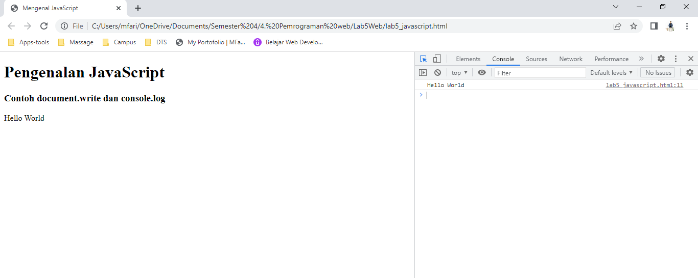

# Lab5Web

**Nama  : Mohamad Farizal Arifin**

**Nim   : 312010231**

**Kelas : TI.20.B.1**

<br>

**Langkah - langkah praktikum**<br>
Persiapan membuat dokumen HTML dengan nama file **lab5_javascript.html** seperti berikut.<br>

```
<!DOCTYPE html>
<html lang="en">
<head>
    <title>Mengenal JavaScript</title>
</head>
<body>
    <h1>Pengenalan JavaScript</h1>
    <h3>Contoh document.write dan console.log</h3>
    <script>
        document.write("Hello World");
        console.log("Hello World");
    </script>
</body>
</html>
```
<br>
Kemudian buka browser untuk melihat hasilnya. <br>
Berikut hasilnya :<br>
<br>

 <br>
<br>

**Javascrip Dasar**<br>

Pemakaian Alert sebagai property window.<br>
 <br>
<br>

Pemakaian method dalam objek<br>
 <br>
<br>
